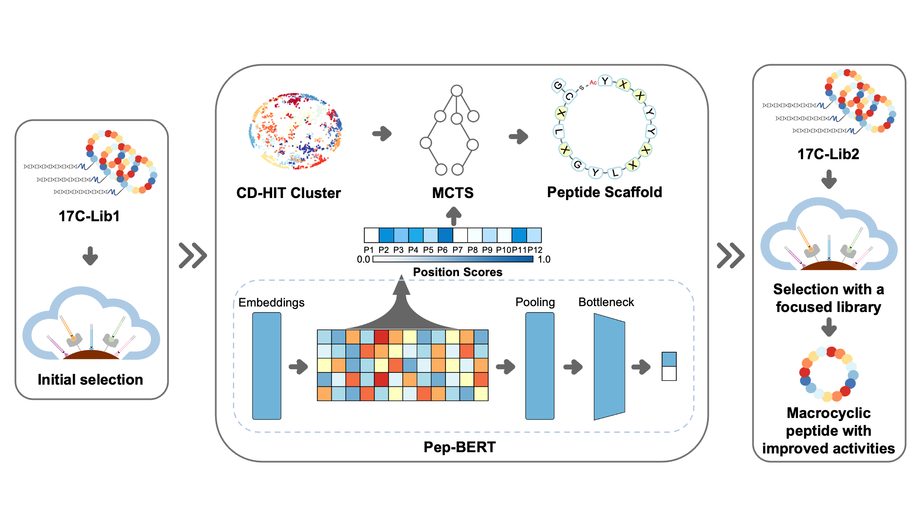

# PepScaf

This repository contains the implementation code for paper [PepScaf: harnessing machine learning with in vitro selection towards de novo macrocyclic peptides against IL-17C/IL-17RE interaction]().

In this study, we first conducted the in vitro selection of macrocyclic peptides against interleukin-17C (IL-17C) using a primary library (17C-Lib1), which gave us a macrocyclic peptide ligand capable of inhibiting IL-17C/IL-17RE interaction with the $IC_{50}$ value at *166* nM. To further improve the activity, we built a framework termed PepScaf to generate the critical scaffold relative to the bioactivity on the basis of the vast dataset generated from the 4th round of 17C-Lib1. Based on the generated scaffold, a focus library (17C-Lib2) was constructed and applied in a macrocyclic peptide selection against IL-17C again. This afforded us with *20* biologically active macrocyclic peptides against IL-17C/IL-17RE interaction with $IC_{50}$ values below *10* nM, of which the best two macrocyclic peptides exhibited their notable inhibitory activities with both IC50 values at *1.4* nM.



## Installation

The code was test on `GPU 3060` with

- `python=3.8`
- `pytorch==1.12.1`
- `cudatoolkit=11.3`

### Conda

We use `conda` to install the dependencies for PepScaf from the provided `environment.yml` file, which can give you the exact python environment we run the code for the paper:

> **NOTE**: we [also](https://github.com/mattragoza/liGAN) highly recommend using [mamba](https://mamba.readthedocs.io/en/latest/) instead of vanilla conda for managing your conda environments. Mamba is a drop-in replacement for conda that is:

- Faster at solving environments (>10x in my experience)
- Better at resolving conflicts
- More informative when something goes wrong.

```bash
git clone https://github.com/hongliangduan/PepScaf.git
cd PepScaf
mamba env create -f environment.yml
pip install sci-ztools==0.1.0

mamba activate pepscaf
```

## Run

### Preprocess

```bash
python bin/preprocessing.py  # preprocessing for raw data
python bin/cluster.py  # get cluster to get targets

# Train and Evaluation
bash train.sh
bash eval.sh

# Analysis on cluster
bash get_attn.sh
```

Run `notebooks/Score.ipynb` to get position scores.

```bash
bash mcts.sh  # run mcts to get the scaffold
```

## Acknowledgements

1. The implementation of Pep-BERT is partly inspired by [A transformer-based model to predict peptide–HLA class I binding and optimize mutated peptides for vaccine design](https://www.nature.com/articles/s42256-022-00459-7) and [MolSearch: Search-based multi-objective molecular generation and property optimization](https://doi.org/10.1145/3534678.3542676).
2. The Pep-BERT was build based fon [pytorchic-bert](https://github.com/dhlee347/pytorchic-bert), which is a re-implementation of [Google BERT](https://github.com/google-research/bert) model in Pytorch.
3. The code was formatter by [Black](https://github.com/psf/black).
4. The building of MCTS parts refered to int8's [mcts](https://github.com/int8/monte-carlo-tree-search).
5. [weblog](https://weblogo.berkeley.edu/logo.cgi)
6. The visualization of attention was modified from [Pytorch Community](https://pytorch.org/tutorials/)
7. The [CD-HIT](https://sites.google.com/view/cd-hit) tool and [Biopython](https://biopython.org) was used for clustering sequence-based macrocyclic peptides.

## Citation

If you find the idea or code useful for your research, please cite [our paper]():

> @article{
> }

## Contact

Please contact hduan@zjut.edu.cn if you have any question. Enjoy!
